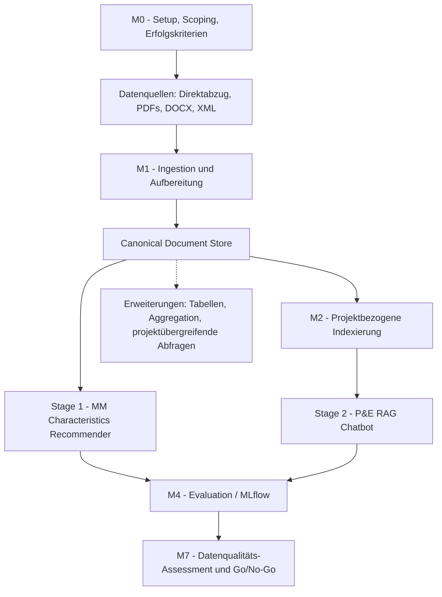
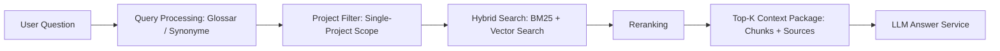

# Primetals Architektur

Source: Notion page `Architektur` (`https://app.notion.com/p/390e185400fb803c863ce40c01739554`)

Synced: 2026-07-08

## Systemarchitektur und technisches Gesamtkonzept

Die Lösung wird als Azure-basierte, modulare Service-Architektur umgesetzt. Die gemeinsame Dokumentenaufbereitung bildet die technische Basis für zwei Use Cases:

- Material Master Characteristics Recommender
- P&E Chatbot

Beide Use Cases teilen dieselbe technische Basis. Der Material Master Characteristics Recommender hat Prio 1, der P&E Chatbot Prio 2.

Die Architektur ist service-orientiert. Zentrale Funktionen wie OCR/Layout-Extraktion, Metadaten-Mapping, Chunking, Retrieval, Reranking, Antwortgenerierung und Evaluation werden als klar abgegrenzte Services bzw. austauschbare Komponenten umgesetzt. Dadurch kann im PoC die jeweils beste Technologie evaluiert werden, ohne die Gesamtarchitektur fest an einen einzelnen Anbieter oder eine einzelne Library zu koppeln.

## Gesamtfluss

## Common Azure Foundation

Übergreifende Komponenten:

- Azure Key Vault: Secrets, API Keys und Konfiguration
- Azure Monitor / Application Insights: Logs, Traces und Runtime-Metriken
- MLflow: Evaluation Runs, Metriken und Artefakte
- Azure Blob Storage oder Azure Data Lake Storage Gen2: Raw Landing Zone und normalisierter Document Store
- Azure Functions oder Azure Container Apps: Orchestrierung und Runtime

## Stage 1: Material Master Characteristics Recommender, OCR und Classifier

Stage 1 verarbeitet Primetals-Dokumente zu einer normalisierten und bewertbaren Datenbasis. Der Recommender arbeitet auf Materialstamm-Ebene. Pro Material werden mehrere verknüpfte Dokumente genutzt, der ECLASS-Export dient als Referenz-Taxonomie.

### Dokumentaufnahme

| Funktion | Technische Umsetzung | Tool / Service |
| --- | --- | --- |
| Ablage des Direktabzugs | Speicherung gelieferter Einzeldokumente | Azure Blob Storage oder ADLS Gen2 |
| Pipeline-Orchestrierung | Startet Parsing, OCR, Klassifikation, Metadaten-Mapping und Qualitätsmessung | Azure Functions oder Azure Container Apps |
| Secrets & Konfiguration | API Keys, Endpoints, Modellnamen | Azure Key Vault |
| Runtime Logging | Technische Logs und Laufzeitmetriken | Azure Monitor / Application Insights |

### OCR & Parsing Router

| Funktion | Technische Umsetzung | Tool / Service |
| --- | --- | --- |
| Prüfung Textlayer | Erkennt, ob ein PDF maschinenlesbaren Text enthält | Python / PyMuPDF / pypdf oder Docling |
| Native PDF-Extraktion | Extraktion von Text, Tabellen und Layout | Docling oder Custom Python Parser |
| OCR für Scans | OCR für gescannte und zeichnungslastige PDFs | Azure AI Document Intelligence |
| OCR-/Parsing-Vergleich | Variantenvergleich je Dokumenttyp | Azure Document Intelligence, Docling, optional Mistral OCR |
| Routing-Logik | Auswahl der besten Extraktionsvariante je Dokument | Python / FastAPI OCR Router |
| Messung | OCR-Konfidenz, Tabellenqualität, Verarbeitungsquote | MLflow |

Der OCR Router wird als austauschbarer Service implementiert. Jeder Ingestion-Lauf je OCR-/Parsing-Variante wird als eigener MLflow-Run mit Parametern, Metriken und Artefakten protokolliert.

### Document Classifier

| Funktion | Technische Umsetzung | Tool / Service |
| --- | --- | --- |
| Dokumenttyp-Klassifikation | STL, ZSZ, PAV, Datenblatt, Zeichnung, Spezifikation | Azure OpenAI / Azure AI Foundry oder Custom Classifier |
| Layout-Klassifikation | Tabellarische, zeichnungslastige oder freitextliche Dokumente | Azure AI Document Intelligence Layout Output + Python Rules |
| Tabellenstruktur-Erkennung | Tabellen, Spalten, Header, Zeilenstruktur | Azure AI Document Intelligence / Docling |
| Qualitätsklassifikation | Scanqualität, OCR-Konfidenz, Tabellenqualität | Custom Quality Scoring |
| Pipeline-Routing | Ziel: Recommender, Chatbot-Index oder Review | Custom Pipeline Router |

### Metadata Mapper

| Funktion | Technische Umsetzung | Tool / Service |
| --- | --- | --- |
| XML-Verarbeitung | Parsing von VAIDrawing-XML oder vergleichbaren Metadaten | Python XML Parser |
| Feldmapping | ProjectCode, DocumentNo, DocumentType, Revision, Mass | Custom Metadata Mapper |
| OCR-/XML-Abgleich | Prüfung extrahierter Werte gegen strukturierte Metadaten | Python Validation Rules |
| Persistierung | Metadaten neben normalisiertem Dokumentinhalt | ADLS, optional Azure SQL oder Cosmos DB |
| Lineage | OriginalFileId -> DocumentId -> PageId -> TableId -> ChunkId | Azure SQL oder Cosmos DB |

### Recommender Output

Der Output ist ein strukturierter JSON-Datensatz mit:

- ECLASS-Vorschlag
- Characteristics
- Werte und Einheiten
- Confidence
- Quellenangaben
- Human-in-the-Loop-Status

## Stage 2: P&E RAG Chatbot

Stage 2 nutzt den Canonical Document Store aus Stage 1 und baut darauf eine projektbezogene RAG-Kette auf. Der P&E Chatbot arbeitet im PoC mit Dokumenten über mehrere Pilotprojekte; Antworten erfolgen innerhalb genau eines Projektkontexts.

### Custom Chunking Service

| Funktion | Technische Umsetzung | Tool / Service |
| --- | --- | --- |
| Strukturabhängiges Chunking | Abschnitte, Tabellen, Überschriften, Seiten, Dokumentnummern | Python Chunking Service |
| Tabellenbewusstes Chunking | Tabellen bleiben als strukturierte Chunks erhalten | Python, Pandas, JSON Table Parser |
| Metadaten-Anreicherung | Projekt, Dokumenttyp, Seite, Revision, DocumentNo | Metadata Mapper |
| Domänen-Glossar | Technische Synonyme und Begriffe | Glossar aus M0 |
| Persistierung | Ablage der Chunks | ADLS, optional Azure SQL |

### Embedding und Indexierung

| Funktion | Technische Umsetzung | Tool / Service |
| --- | --- | --- |
| Text-Embeddings | Vektorisierung der Chunks | Azure OpenAI Embeddings |
| Batch-Verarbeitung | Verarbeitung vieler Chunks | Azure Container Apps Jobs oder Azure Functions |
| Fehlerbehandlung | Retry und Dead Letter Queue | Azure Service Bus |
| Speicherung | Embedding + Chunk-Metadaten | Azure AI Search und/oder PGVector |

### Projektbezogene Knowledge Base

| Funktion | Technische Umsetzung | Tool / Service |
| --- | --- | --- |
| Projekttrennung | Ein Index bzw. eine Vektor-DB pro Projekt | Collections / Indizes |
| Semantische Suche | Suche über Embeddings | Vector Search |
| Volltextsuche | Exakte Suche nach Dokumentnummern, Codes, Positionen | BM25 |
| Hybrid Search | Kombination aus BM25 und Vector Search | Hybrid Search |
| Metadatenfilter | Projekt, Dokumenttyp, Revision, DocumentNo | Search Filters |
| Quellenfähigkeit | Rückführung auf Dokument, Seite und Chunk | Chunk Metadata + Citation Formatter |

### Retrieval API

### Prompt & Grounding Service

| Funktion | Technische Umsetzung | Tool / Service |
| --- | --- | --- |
| Prompt-Aufbau | System Prompt, Frage, Kontext, Antwortregeln | Custom Prompt Service |
| Quellenpflicht | Antwort nur mit referenzierten Quellen | Prompt Rules |
| No-Answer-Verhalten | Keine Halluzination bei fehlender Quelle | Prompt Rules + Guardrails |
| Domänen-Glossar | Terminologische Leitplanken | Glossar aus M0 |
| Zitierformat | Dokumentnummer, Seite, ChunkId, optional Link | Custom Citation Formatter |

## Stage 3: Agentic Extensions, Out of Scope

Stage 3 ist nicht Teil des Kernumfangs, aber architektonisch vorgesehen:

- Azure AI Foundry Agents oder Microsoft Agent Framework
- Tool Registry über MCP Server oder REST APIs
- Recommender Tool
- RAG Tool
- Deterministische Tools für Python/Pandas/openpyxl
- SAP-, P&E-, DMS- oder Ticketing-APIs
- Human Approval, Audit Logging und Monitoring

## Evaluation und Abschluss

MLflow wird als zentrale Evaluierungs- und Vergleichsplattform genutzt. Bewertet werden unter anderem:

- OCR-Qualität
- Tabellenqualität
- Metadaten-Vollständigkeit
- Retrieval Recall
- Answer Correctness
- Faithfulness / Groundedness
- Citation Accuracy
- Extraktionsqualität je Characteristic

Der Abschluss verdichtet die Ergebnisse zu einem Datenqualitätsurteil, einer Go/No-Go-Empfehlung und einer Aufwandsindikation für ein Folgeprojekt.
